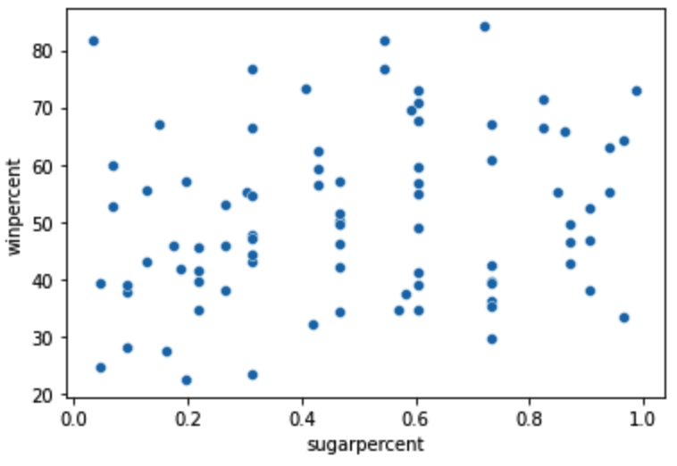
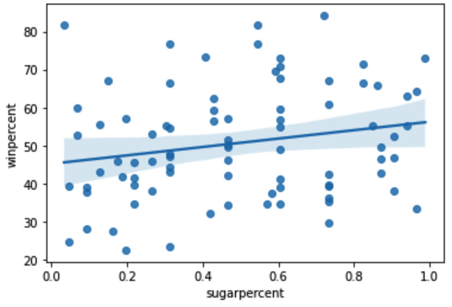
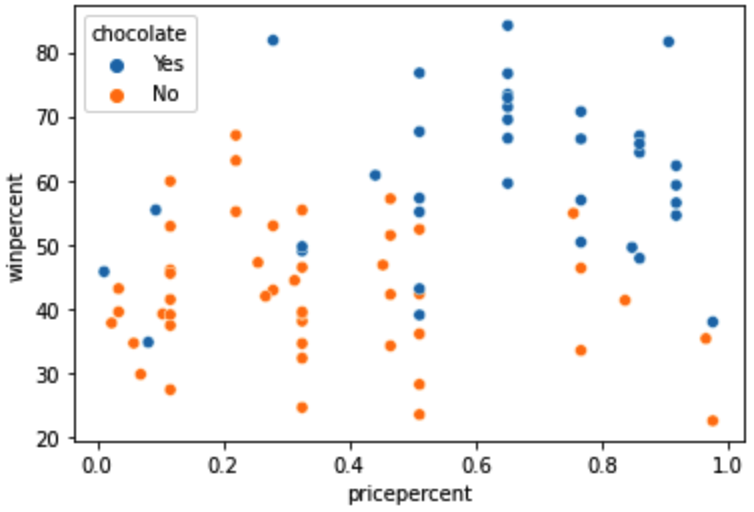
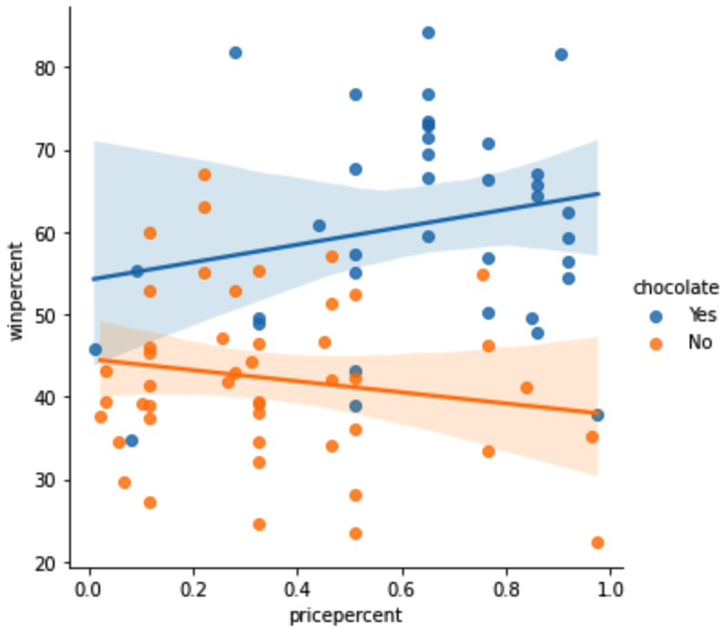
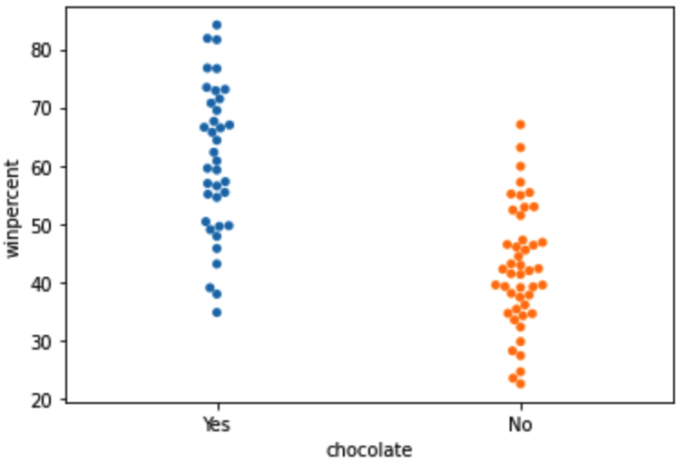
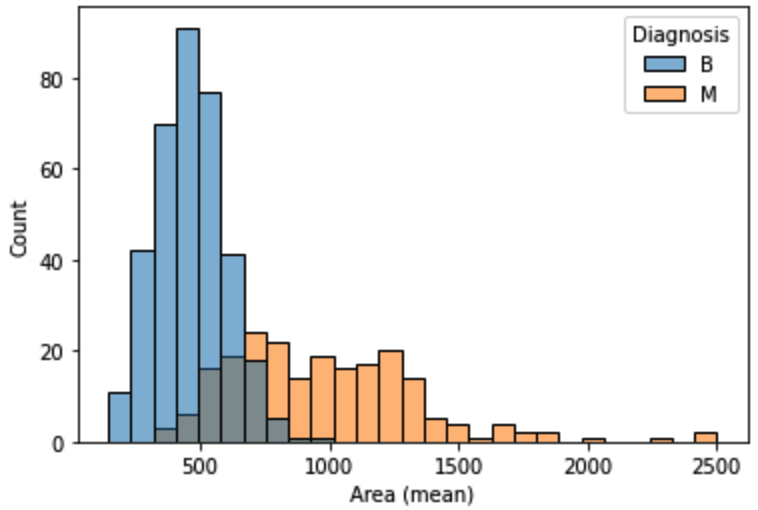
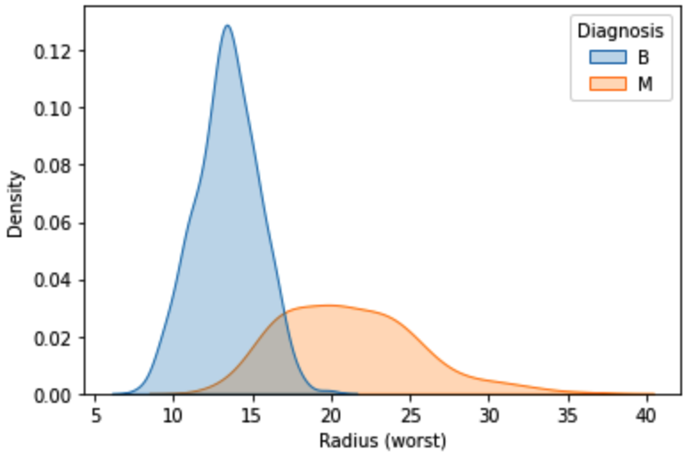

# Data Visualization

> https://www.kaggle.com/learn/data-visualization

```Python
import matplotlib.pyplot as plt
%matplotlib inline
import seaborn as sns
```

由于决定如何最好地讲述你的数据背后的故事并不容易，我们将图表类型分成三大类来帮助解决这个问题：

- 趋势

  \- 趋势被定义为改变的一种模式

  - `sns.lineplot` - **线图**最适合显示一段时间内的趋势，多条线可以用来显示多组的趋势

- 关系

  \- 有许多不同的图表类型，可以用来了解数据中变量之间的关系

  - `sns.barplot` - **条形图**对于比较不同组别对应的数量非常有用
  - `sns.heatmap` - **热图**可用于在数字表格中找到彩色编码的模式
  - `sns.scatterplot` - **散点图**显示两个连续变量之间的关系；如果用颜色编码，我们还可以显示与第三个[分类变量](https://en.wikipedia.org/wiki/Categorical_variable )的关系
  - `sns.regplot` - 在散点图中包括一条**回归线**，可以更容易看到两个变量之间的任何线性关系。
  - `sns.lmplot` - 如果散点图包含多个彩色编码的组，该命令对于绘制多条回归线非常有用
  - `sns.swarmplot` - **分类散点图**显示连续变量和分类变量之间的关系

### 折线图

```Python
plt.figure(figsize=(12,6))
sns.lineplot(data=museum_data, index_col=['date'])  # 可能包含多个index，因此是数组形式
plt.title("Monthly Visitors to Los Angeles City Museums")
```

### 柱状图

```Python
sns.barplot(x=ign_data['Racing'], y=ign_data.index)
```

注意，不能直接访问index的名称（在设置了`index_col`之后）

### 热力图

```Python
sns.heatmap(ign_data, annot=True)
```

### 散点图

```Python
sns.scatterplot(x=candy_data['sugarpercent'], y=candy_data['winpercent'])
```



### 拟合散点图

```Python
sns.regplot(x=candy_data['sugarpercent'], y=candy_data['winpercent'])
```



### 分类散点图

```Python
sns.scatterplot(x=candy_data['pricepercent'], y=candy_data['winpercent'], 							hue=candy_data['chocolate'])
```

能够在显示x, y的基础上展示每个点的具体类别



### 多变量拟合散点图

```Python
sns.lmplot(x="pricepercent", y="winpercent", hue="chocolate", data=candy_data)
```



### 分簇散点图

```Python
sns.swarmplot(x='chocolate', y='winpercent', data=candy_data)
```



### 直方图

```Python
sns.histplot(data=cancer_data, x='Area (mean)', hue='Diagnosis')
```



### 核密度估计图

```Python
sns.kdeplot(data=cancer_data, x='Radius (worst)', hue='Diagnosis', shade=True)
```



