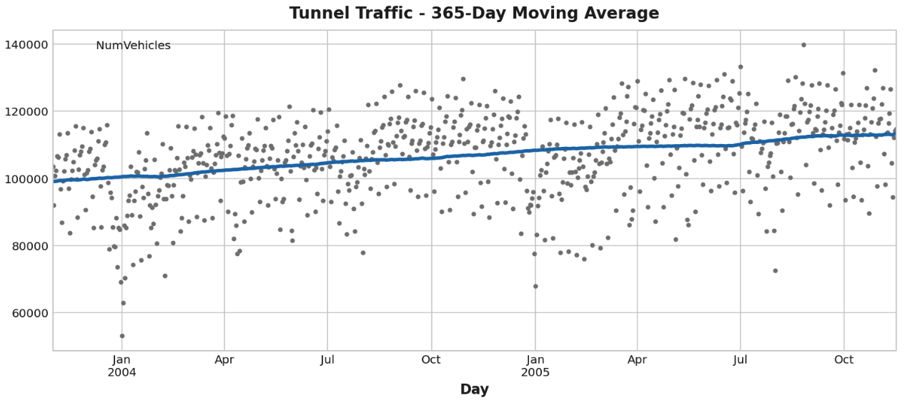
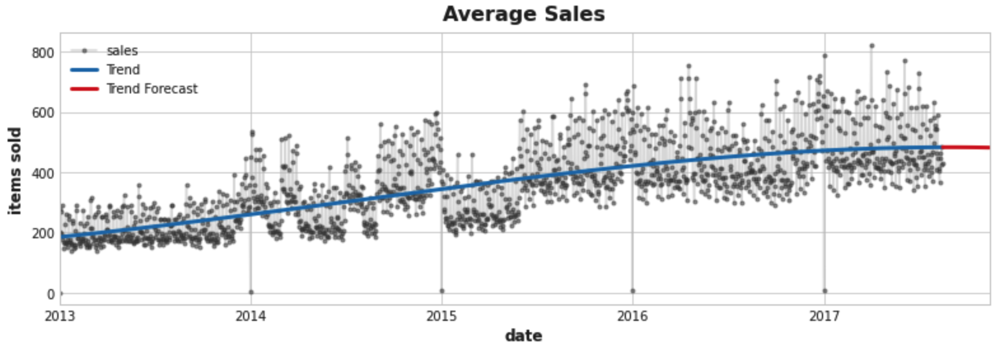

# Time Series 时间序列

> https://www.kaggle.com/learn/time-series

### Linear Regression with Time Series

时间序列有两种独特的特征：时间步长特征 (time-step features) 和滞后特征 (lag features)

```Python
from sklearn.linear_model import LinearRegression
```

 **time dummy**（虚拟变量）是最基本的时间步长特征

```python
df['Time'] = np.arange(len(df.index))  # 创建一个从0到1的新列
```

将会产生类似的线性模型`target = weight * time + bias`

产生并拟合序列数据

```Python
X = df.loc[:, ['time']]  # features
y = df.loc[:, 'sales']  # target
```

训练

```Python
model = LinearRegression()
model.fit(X, y)
```

**lag feature**（滞后特征）改变了目标系列的观察结果，使它们看起来发生在较晚的时间

因此，滞后特征让我们可以将曲线拟合到滞后图中，其中系列中的每个观察值都与前一个观察值相对应

类似`target = weight * lag + bias`

产生lag feature

```Python
df['Lag_1'] = df['NumVehicles'].shift(1)  # 从待预测值中产生时间数据
df.head()
```

产生并拟合序列数据

```Python
X = df.loc[:, ['Lag_1']]
X.dropna(inplace=True)  # drop missing values in the feature set
y = df.loc[:, 'NumVehicles']  # create the target
y, X = y.align(X, join='inner')  # 默认返回join='inner’的对齐方式,提取两者变量索引交集的数据
```

训练

```Python
model = LinearRegression()
model.fit(X, y)
```

预测

```Python
y_pred = pd.Series(model.predict(X), index=X.index)
```

同时展示预测和原始图

```Python
fig, ax = plt.subplots()
ax = y.plot(**plot_params, alpha=0.5)
ax = y_pred.plot(ax=ax, linewidth=3)
ax.set_title('Time Plot of Total Store Sales');
```

### Trend

```Python
moving_average = tunnel.rolling(
    window=365,       # 窗口大小为365
    center=True,      # 将平均值置于窗口中心
    min_periods=183,  # 值取窗口大小的一半左右
).mean()              # 计算均值 (也可以使用 median, std, min, max, ...)

ax = tunnel.plot()
moving_average.plot(ax=ax)
```



在此前的课程中，我们直接在 Pandas 中实现了time dummy。从现在开始，我们将使用 `statsmodels` 库中的一个名为 `DeterministicProcess` 的函数。其中， `order` 参数是指多项式顺序：1 表示线性，2 表示二次，3 表示三次，依此类推

```Python
from statsmodels.tsa.deterministic import DeterministicProcess

dp = DeterministicProcess(
    index=y.index,  		 # 来自训练数据的日期
    order=3,             # 3 表示：三次多项式顺序，过高可能引起过拟合
    drop=True,           # 必要时删除以避免共线性
)

X = dp.in_sample()
```

生成向后的预测

```Python
X_fore = dp.out_of_sample(steps=90)
```

作图

```Python
model = LinearRegression()
model.fit(X, y)

y_pred = pd.Series(model.predict(X), index=X.index)
y_fore = pd.Series(model.predict(X_fore), index=X_fore.index)

ax = y.plot(**plot_params)
ax = y_pred.plot(ax=ax, label="Trend", color='C0')
ax = y_fore.plot(ax=ax, label="Trend Forecast", color='C3')
ax.legend()
```



### Seasonal Plots and Seasonal Indicators

**Seasonal Indicators** 季节性指标：

季节性指标是表示时间序列水平的季节性差异的二元特征。将季节性时段视为分类特征并使用独热编码，则可以得到季节性指标（例如一周七天转化为7个独热编码）

### Fourier Features and the Periodogram

**Fourier Features** 傅里叶特征：

傅里叶特征是正弦和余弦曲线对，从最长的季节开始，每个潜在频率对应一对，模拟年度季节性的傅里叶对将具有频率：每年一次、每年两次、每年三次，等等。傅立叶特征不是为每个日期创建一个特征，而是尝试用几个特征来捕捉季节性曲线的整体形状

可以使用**periodogram**周期图表示时间序列中频率的强度

```Python
plot_periodogram(tunnel.NumVehicles);
```

转换日期型数据

```Python
df = pd.read_csv('df_weekgroup.csv',parse_dates = ['date'])
df['y'] = df.date.dt.year   # 获取年
```

生成模型

```Python
fourier = CalendarFourier(freq='M', order=4)  # 每月的四阶傅里叶特征
dp = DeterministicProcess(
    index=y.index,
    constant=True,
    order=1,
    seasonal=True,
    additional_terms=[fourier],
    drop=True,
)
X = dp.in_sample()
```

预测

```Python
model = LinearRegression().fit(X, y)
y_pred = pd.Series(
    model.predict(X),
    index=X.index,
    name='Fitted',
)

y_pred = pd.Series(model.predict(X), index=X.index)
```

